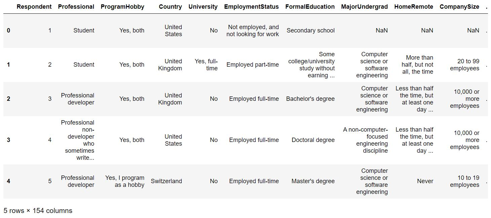
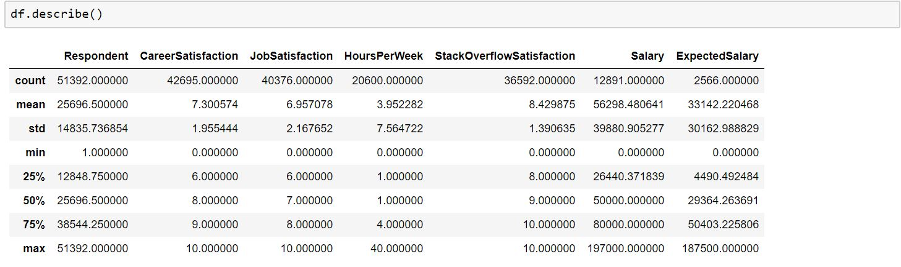
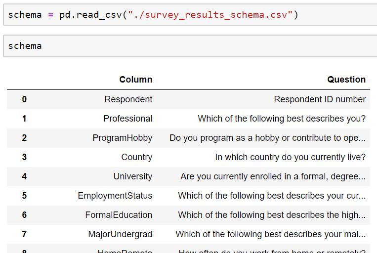
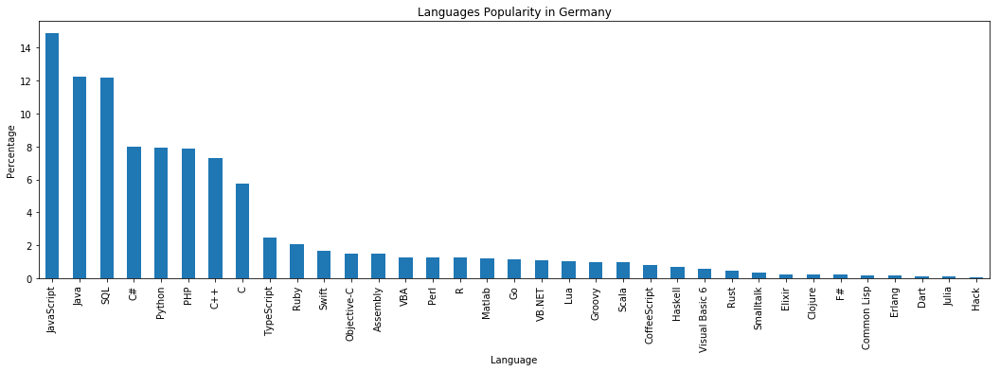
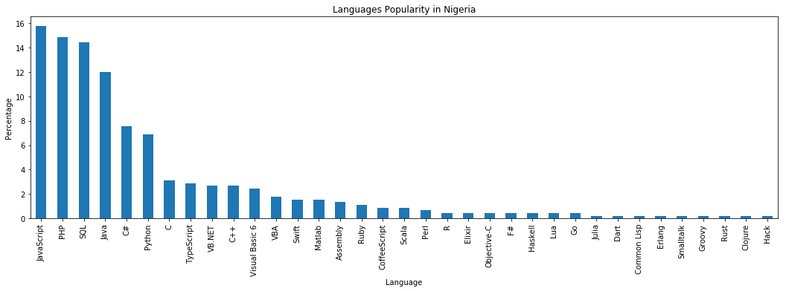
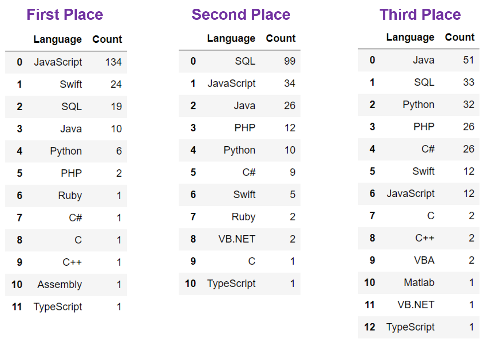
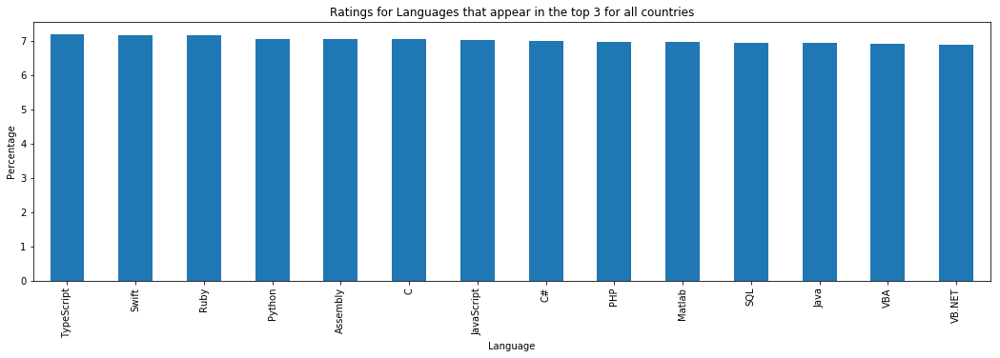
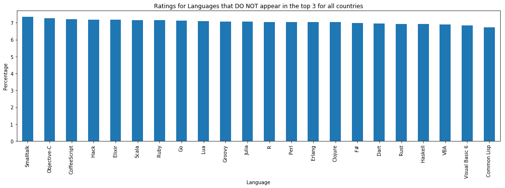

# Insights into Gaining Insights from Data#

This is blog as part of my in Udacity DataScience nanao degree. Data Science is fun and enpowering, this posts shares my project on gaining insights from raw data.. 

The data set used is the **Stack Overflow Data - 2017 Survey** that was provided with the course material. Here we start withthe insights we would like to gain, and then let the data guide us.

# Insight in Knowledge #

The question of interest to me are:

- Q1. What are the most popular languages by country
- Q2. Is there a correlation between most popular languages choice and job satisfaction
- Q3. How does parent's highest education relate to highest respondent education
- Q4. Does remote work increase need for StackoverFlow? 

## Get the data, check the data, and clear the way

The first step is getting the data. But before we do that - it is relevant to state the tools we will be using for the data analysis. 
I worked with Python in a Jupyter Notebook and Pandas & Matplotlib. 

The data was already provided in a cvs format; this make the data acollection step, not required. The files were moved to the relevant 
folders Pandas read_csv was used to import the data. 

Below is a snapshop of the dataframe head.

The data was clean and not much pre-processing was required. Additional processing was done to answer each quesion, and we will see that later in the blog.

Below is a description of the data:

The data package also includes a schema that provides the survey questions. See a snapshot below.

## Question 1 - What are the most popular languages by country
To answer the first question I used the **Country** and **HaveWorkedLanguage** columns. The **Country** column was straing forward and provided a single entry - the country of the respondent - but **HaveWorkedLanguage** column needed additional processing. Each entry was 
a concatenated string of all the languages the responded has worked with, separated by a semi-colon. The unique value of each language was needed to find our their popularity by country. See below the popularity of languages for a few countries.

 ## Which are the popular languages across the globe?

To answer this question, I checked which languages appear most frequenty in the top spot: **JavaScript** was the clear winner. See tables below for the languages that appeared the most in taking the top, second and third places in all countries around the world.

## Question 2 - Is there a correlation between most popular languages choice and job satisfaction

To answer this question we explored the **JobSatisfaction** column of the dataset, and checkecked is against the most popular (top three in all countries), and the not so poplar (everytoher language). Simple ansers: There is no significant correclation between job satisfaction and language popularity. See charts below:

## Question 3 - Does the Apple Fall Far from the Tree

In question 3, we attempt to get insights into the question *How does parent's highest education relate to highest respondent education?*. TO check in the ways of the ancients - where the trade staysin the family is also true for the technology world - you will be happy to konw it does not. There was no significant correlation between the parents highest eduction level and those of our respondents. There is however a slight bias in the highest educaiton - ie. offspring of parents with masters and doctoral degrees, tend to have a hgher avergae of obtaining masters and doctoral degrees - but this is  only on average, and was not found to be a determinant. The columns used for this anaylys are **HighestEducationParents** and **FormalEducation** columns. In the charts that follow the following convention was used: 
- 0: No Education
- 1: Primary/Elementary School
- 2: Secondary/High School
- 3:Bachelor's Degree or Professinal Degree
- 4: Master's Degree
- 5: Doctoral Degree

![Education Bar}(Education.png)  ![Education xy}(Education2.png)  

